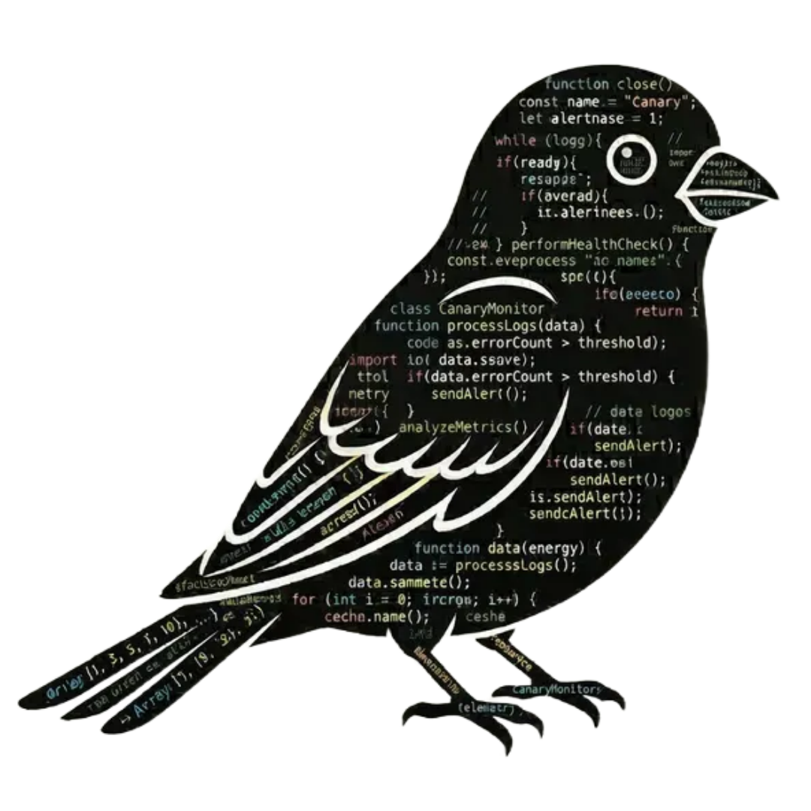
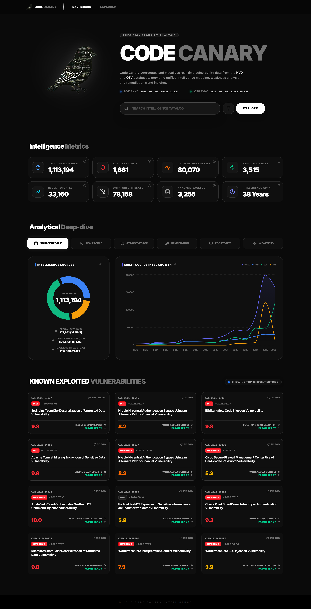
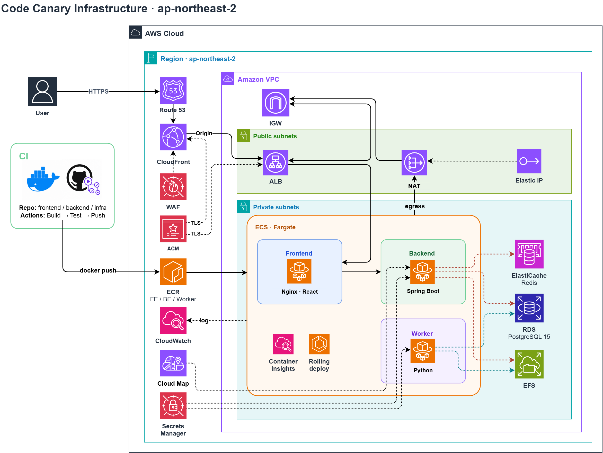

#  Code Canary (취약점 인텔리전스 · 파이프라인 콘솔)

## 💻 Developers

<div align="center">

| <a href="https://github.com/Hyeonseok93" target="_blank"></a> |
| :------------------------------------------------------------------------------------------------------------------------------------: |
|                                                [김현석](https://github.com/Hyeonseok93)                                                |

</div>

---

> [!NOTE]
> NVD · OSV 등 공개 취약점 피드를 수집·정제해 대시보드로 탐색하고, 운영자 콘솔에서 **수집·정제 파이프라인**을 실행·모니터링하는 웹 플랫폼입니다.

## 🚀 Overview

공개 CVE/OSV 데이터를 사람이 일일이 받아 정리하지 않고, **수집 → 적재 → 정제(bronze → silver → gold)** 파이프라인으로 돌린 뒤 탐색 UI에서 바로 볼 수 있게 한 **취약점 인텔리전스 대시보드**입니다. **Code Canary**는 일반 사용자용 Explorer와, 운영자용 Roost 콘솔(로그인·파이프라인 모니터)을 함께 둡니다.

React에서 취약점 탐색·차트·운영자 UI를 제공하고, Spring Boot가 **인증 · analytics API · 파이프라인 오케스트레이션**을 담당합니다. Python Worker가 NVD/OSV를 받아 EFS(`/data`)와 PostgreSQL에 쌓으며, Redis로 레이트 리밋을 겁니다.

**피드 수집 → Worker 파이프라인 → DB/파일 적재 → Explorer / Operator console** 흐름 위에 JWT(HttpOnly 쿠키) 인증, Docker Compose 로컬 기동, AWS ECS Fargate · Terraform · GitHub Actions 배포를 붙여 둔 서비스입니다.

---

## 🛠 Built With

<div align="center">
<p>
<picture>
  <source media="(prefers-color-scheme: dark)" srcset=".github/readme/badges/dark/typescript.png">
  <source media="(prefers-color-scheme: light)" srcset=".github/readme/badges/light/typescript.png">
  
</picture>
<picture>
  <source media="(prefers-color-scheme: dark)" srcset=".github/readme/badges/dark/react.png">
  <source media="(prefers-color-scheme: light)" srcset=".github/readme/badges/light/react.png">
  
</picture>
<picture>
  <source media="(prefers-color-scheme: dark)" srcset=".github/readme/badges/dark/vite.png">
  <source media="(prefers-color-scheme: light)" srcset=".github/readme/badges/light/vite.png">
  
</picture>
<picture>
  <source media="(prefers-color-scheme: dark)" srcset=".github/readme/badges/dark/reactrouter.png">
  <source media="(prefers-color-scheme: light)" srcset=".github/readme/badges/light/reactrouter.png">
  
</picture>
<picture>
  <source media="(prefers-color-scheme: dark)" srcset=".github/readme/badges/dark/tailwindcss.png">
  <source media="(prefers-color-scheme: light)" srcset=".github/readme/badges/light/tailwindcss.png">
  
</picture>
<picture>
  <source media="(prefers-color-scheme: dark)" srcset=".github/readme/badges/dark/tanstackquery.png">
  <source media="(prefers-color-scheme: light)" srcset=".github/readme/badges/light/tanstackquery.png">
  
</picture>
<picture>
  <source media="(prefers-color-scheme: dark)" srcset=".github/readme/badges/dark/zustand.png">
  <source media="(prefers-color-scheme: light)" srcset=".github/readme/badges/light/zustand.png">
  
</picture>
<picture>
  <source media="(prefers-color-scheme: dark)" srcset=".github/readme/badges/dark/axios.png">
  <source media="(prefers-color-scheme: light)" srcset=".github/readme/badges/light/axios.png">
  
</picture>
<picture>
  <source media="(prefers-color-scheme: dark)" srcset=".github/readme/badges/dark/recharts.png">
  <source media="(prefers-color-scheme: light)" srcset=".github/readme/badges/light/recharts.png">
  
</picture>
<picture>
  <source media="(prefers-color-scheme: dark)" srcset=".github/readme/badges/dark/java.png">
  <source media="(prefers-color-scheme: light)" srcset=".github/readme/badges/light/java.png">
  
</picture>
<picture>
  <source media="(prefers-color-scheme: dark)" srcset=".github/readme/badges/dark/springboot.png">
  <source media="(prefers-color-scheme: light)" srcset=".github/readme/badges/light/springboot.png">
  
</picture>
<picture>
  <source media="(prefers-color-scheme: dark)" srcset=".github/readme/badges/dark/springsecurity.png">
  <source media="(prefers-color-scheme: light)" srcset=".github/readme/badges/light/springsecurity.png">
  
</picture>
<picture>
  <source media="(prefers-color-scheme: dark)" srcset=".github/readme/badges/dark/jwt.png">
  <source media="(prefers-color-scheme: light)" srcset=".github/readme/badges/light/jwt.png">
  
</picture>
<picture>
  <source media="(prefers-color-scheme: dark)" srcset=".github/readme/badges/dark/hibernate.png">
  <source media="(prefers-color-scheme: light)" srcset=".github/readme/badges/light/hibernate.png">
  
</picture>
<picture>
  <source media="(prefers-color-scheme: dark)" srcset=".github/readme/badges/dark/postgresql.png">
  <source media="(prefers-color-scheme: light)" srcset=".github/readme/badges/light/postgresql.png">
  
</picture>
<picture>
  <source media="(prefers-color-scheme: dark)" srcset=".github/readme/badges/dark/redis.png">
  <source media="(prefers-color-scheme: light)" srcset=".github/readme/badges/light/redis.png">
  
</picture>
<picture>
  <source media="(prefers-color-scheme: dark)" srcset=".github/readme/badges/dark/gradle.png">
  <source media="(prefers-color-scheme: light)" srcset=".github/readme/badges/light/gradle.png">
  
</picture>
<picture>
  <source media="(prefers-color-scheme: dark)" srcset=".github/readme/badges/dark/python.png">
  <source media="(prefers-color-scheme: light)" srcset=".github/readme/badges/light/python.png">
  
</picture>
<picture>
  <source media="(prefers-color-scheme: dark)" srcset=".github/readme/badges/dark/docker.png">
  <source media="(prefers-color-scheme: light)" srcset=".github/readme/badges/light/docker.png">
  
</picture>
<picture>
  <source media="(prefers-color-scheme: dark)" srcset=".github/readme/badges/dark/nginx.png">
  <source media="(prefers-color-scheme: light)" srcset=".github/readme/badges/light/nginx.png">
  
</picture>
<picture>
  <source media="(prefers-color-scheme: dark)" srcset=".github/readme/badges/dark/terraform.png">
  <source media="(prefers-color-scheme: light)" srcset=".github/readme/badges/light/terraform.png">
  
</picture>
<picture>
  <source media="(prefers-color-scheme: dark)" srcset=".github/readme/badges/dark/githubactions.png">
  <source media="(prefers-color-scheme: light)" srcset=".github/readme/badges/light/githubactions.png">
  
</picture>
</p>
</div>

<details>
<summary><strong>기술 스택 상세 보기</strong></summary>

<br>

<div align="center">

<table align="center">
  <thead>
    <tr>
      <th align="left">구분</th>
      <th align="left">기술</th>
      <th align="left">역할</th>
    </tr>
  </thead>
  <tbody>
    <tr>
      <td align="left"><strong>Frontend Core</strong></td>
      <td align="left">TypeScript, React 19, Vite 8</td>
      <td align="left">Explorer · Operator SPA 렌더링·번들</td>
    </tr>
    <tr>
      <td align="left"><strong>Routing &amp; UI</strong></td>
      <td align="left">React Router DOM 7, Tailwind CSS 4, Lucide, Recharts</td>
      <td align="left">페이지 라우팅, 스타일, 아이콘, 취약점 차트</td>
    </tr>
    <tr>
      <td align="left"><strong>State &amp; HTTP</strong></td>
      <td align="left">TanStack Query, Zustand, Axios</td>
      <td align="left">서버 상태 캐시, 클라이언트 상태, API 통신</td>
    </tr>
    <tr>
      <td align="left"><strong>Backend Core</strong></td>
      <td align="left">Java 21, Spring Boot 3.5, Spring Web, Spring Data JPA, Validation, Actuator</td>
      <td align="left">인증·analytics·파이프라인 API, 헬스체크</td>
    </tr>
    <tr>
      <td align="left"><strong>Auth &amp; Security</strong></td>
      <td align="left">Spring Security, JWT (HttpOnly 쿠키), 로그인 락아웃·레이트 리밋</td>
      <td align="left">운영자 콘솔 보호, Redis 기반 제한</td>
    </tr>
    <tr>
      <td align="left"><strong>Persistence</strong></td>
      <td align="left">PostgreSQL 15, Redis 7, Hibernate / JPA, Flyway(해당 시)</td>
      <td align="left">취약점·파이프라인 메타 저장, 캐시·레이트리밋</td>
    </tr>
    <tr>
      <td align="left"><strong>Worker / Pipeline</strong></td>
      <td align="left">Python 3.12, collector → loader → refinery</td>
      <td align="left">NVD/OSV ingest, bronze → silver → gold, EFS <code>/data</code></td>
    </tr>
    <tr>
      <td align="left"><strong>Edge &amp; Proxy</strong></td>
      <td align="left">Nginx (unprivileged), Cloud Map upstream</td>
      <td align="left">정적 서빙, <code>/api/*</code> → Backend, operator IP allowlist</td>
    </tr>
    <tr>
      <td align="left"><strong>Build &amp; Container</strong></td>
      <td align="left">Docker, Docker Compose, ECR, Gradle, Vitest</td>
      <td align="left">FE/BE/Worker 이미지·로컬 스택·FE 테스트</td>
    </tr>
    <tr>
      <td align="left"><strong>Infrastructure</strong></td>
      <td align="left">Terraform, VPC, ALB, ECS Fargate, EFS, RDS, ElastiCache, CloudFront, WAF, Route53, ACM, Secrets Manager, CloudWatch, Cloud Map</td>
      <td align="left">IaC 기반 엣지·컴퓨트·데이터·관측 (edge는 go-live 시 활성화)</td>
    </tr>
    <tr>
      <td align="left"><strong>CI/CD &amp; Ops</strong></td>
      <td align="left">GitHub Actions, ECR Push, ECS rolling deploy + circuit breaker</td>
      <td align="left">이미지 빌드·푸시·서비스 갱신</td>
    </tr>
  </tbody>
</table>

</div>

</details>

---

## 🖥️ Preview

<div align="center">


<p>Dashboard — NVD/OSV 통합 인텔리전스 · 메트릭 · KEV</p>

<table align="center">
  <thead>
    <tr>
      <th align="left">화면</th>
      <th align="left">설명</th>
    </tr>
  </thead>
  <tbody>
    <tr>
      <td align="left">🔎 Explorer</td>
      <td align="left">CVE/OSV 검색·필터·상세, 심각도·소스 배지</td>
    </tr>
    <tr>
      <td align="left">📊 Analytics</td>
      <td align="left">공개 통계·차트 (레이트 리밋 적용)</td>
    </tr>
    <tr>
      <td align="left">🪺 Roost (Operator)</td>
      <td align="left"><code>VITE_ADMIN_*</code> 경로의 운영자 콘솔 (로그인·파이프라인 모니터)</td>
    </tr>
    <tr>
      <td align="left">🐣 Hatch</td>
      <td align="left">운영자 로그인</td>
    </tr>
    <tr>
      <td align="left">🌾 Forage</td>
      <td align="left">파이프라인 모니터</td>
    </tr>
  </tbody>
</table>

</div>

---

## 🌟 Key Implementation

1. **취약점 피드를 bronze → silver → gold로 나눠 적재 (Medallion)**  
   NVD·OSV는 양이 크고 형식이 제각각이라, 한 테이블에 바로 넣으면 “원본 보관 / 검색용 정리 / 차트용 집계”가 한꺼번에 꼬입니다. 그래서 PostgreSQL 스키마를 **세 층**으로 나눴습니다.
   - **Bronze:** 받은 JSON을 거의 그대로 둡니다. 정제 규칙을 바꿔도 원본부터 다시 돌릴 수 있고, 내용 해시가 같으면 같은 건 다시 넣지 않습니다.
   - **Silver:** CVE·OSV를 표 형태로 정규화합니다. 설명·점수·CWE·영향 패키지 등을 여기서 찾고, 정제에 실패한 건 남기지 않습니다(fail-closed).
   - **Gold:** 대시보드 숫자·차트·Explorer 검색용 결과를 미리 만들어 둡니다. 화면 API는 bronze/silver를 직접 조인하지 않고 **gold만 읽습니다**.
   - 워커 흐름은 `수집(파일 /data) → bronze 적재 → silver 정제 → gold 갱신` 이고, 단계별 시각은 `ingestion_sync`에 남깁니다.

2. **NVD(CVE)와 OSV를 하나의 Explorer로 통합**  
   출처가 다른 두 피드를 화면에서 따로 두지 않고, Gold의 통합 목록에서 검색·상세·차트가 같은 기준으로 보이게 맞췄습니다.
   - OSV의 CVE 식별자로 NVD 쪽과 연결해, 중복·연관 관계를 한 목록에서 따라갈 수 있습니다.

3. **운영자 콘솔(Roost)에서 수집·정제 파이프라인을 실행·중단**  
   NVD/OSV 전체 수집과 bronze→gold 정제는 수십 분 이상 걸릴 수 있어, SSH로 스크립트만 돌리기 어렵습니다. Roost에서 단계를 실행하고 진행·로그를 보고, 필요하면 중단합니다.
   - 콘솔 주소는 빌드할 때 시크릿으로 넣고(`/admin` 고정이 아님), 로그인은 HttpOnly JWT + Redis 잠금입니다. Redis가 죽으면 로그인을 열어 두지 않습니다.

---

## 🗂 Domain Model & API

PostgreSQL을 **management · bronze · silver · gold** 스키마로 나누고, Spring Boot REST API가 **인증 · 파이프라인 실행 · analytics/explorer** 를 도메인으로 노출합니다. (JPA는 `users`·`intel_summary` 중심, 나머지 적재·정제는 Worker SQL)

- NVD/OSV 원본은 **bronze.`raw_vulnerability_data`**(JSONB · content-hash upsert)에 적재되고, Silver refine 후 Gold snapshot·Explorer MV로 승격됩니다. 상태는 bronze `PENDING` / `PROCESSED` / `ERROR`와 `gold.ingestion_sync`로 추적합니다.
- Silver는 **CVE(`cve_vulnerabilities`)** · **OSV(`osv_vulnerabilities`)** 를 hub로 두고, description·CWE·CVSS·reference·affected package 등 child table이 CASCADE FK로 연결됩니다. OSV↔CVE는 identifier soft link입니다.
- Gold는 dashboard용 distribution·연도 trend·KEV·CWE 통계 snapshot과 **`v_explorer_inventory`(MV)** 통합 검색 레이어입니다. 운영 도메인은 **management.`users` / `revoked_tokens` / `pipeline_jobs`(+logs)** 가 담당합니다.

공개 surface는 analytics(`/api/analytics/*`: metrics · dashboard · vector · ecosystem · weakness · remediation · kev · explorer), 운영 surface는 `/api/auth/*` · `/api/admin/session|logout` · `/api/admin/pipeline/*` 이며, Nginx가 SPA serving과 `/api` reverse proxy를 담당합니다.

<!-- ERD 이미지: dbdiagram.io 등으로 export 후 .github/readme/ 에 두고 아래 주석 해제
<p align="center">
  
</p>
-->

> 상세 ERD 한 장과 주요 API 표는 추후 기술 블로그(또는 위 ERD 이미지)에서 다룹니다.

---

## 📂 Project Structure

```text
WEB_Code-Canary/
┣━━ 📂 .github/
┃   ┣━━ 📂 workflows/                     # CI · Deploy (ECR + ECS)
┃   ┗━━ 📂 readme/                        # README 에셋 (logo · badges · infra)
┃       ┣━━ 🖼️ logo.png
┃       ┣━━ 🖼️ preview.png
┃       ┣━━ 🖼️ Code-Canary-architecture.drawio.png
┃       ┗━━ 📂 badges/{dark,light}/
┣━━ 📂 Canary-frontend/                   # React Explorer · Operator SPA
┃   ┣━━ 📂 src/
┃   ┃   ┣━━ 📂 pages/ · components/ · api/
┃   ┃   ┗━━ 📄 App.tsx
┃   ┣━━ 📄 nginx.conf
┃   ┣━━ 📄 Dockerfile
┃   ┗━━ 📄 package.json
┣━━ 📂 Canary-backend/                    # Spring Boot API
┃   ┣━━ 📂 src/main/java/
┃   ┣━━ 📄 build.gradle.kts
┃   ┗━━ 📄 Dockerfile
┣━━ 📂 Canary-worker/                     # Python ingestion worker
┃   ┣━━ 📂 src/code_canary_worker/
┃   ┃   ┣━━ 📂 collector/ · loader/ · refinery/
┃   ┃   ┗━━ 📄 runner.py
┃   ┣━━ 📄 pyproject.toml
┃   ┗━━ 📄 Dockerfile
┣━━ 📂 Canary-infra/                      # Terraform (dev / staging / prod)
┃   ┣━━ 📂 environments/
┃   ┗━━ 📂 modules/                       # network · alb · ecs · data · storage · …
┣━━ 📂 Canary-local/                      # docker-compose · docker-up
┣━━ 📄 .env.example
┗━━ 📄 README.md
```

---

## 🏗 Infrastructure Overview

<div align="center">
  
</div>

**Route53 → CloudFront/WAF(옵션) → ALB → ECS Fargate(FE Nginx → BE · Worker) + RDS · Redis · EFS** 구조입니다. Private egress는 NAT(+EIP) → IGW, Backend 발견은 Cloud Map, 시크릿은 Secrets Manager, 로그는 CloudWatch입니다. 배포는 **GitHub Actions → ECR → ECS rolling deploy** 입니다.

> HTTPS / CloudFront / WAF / operator CIDR은 go-live 시 Terraform tfvars에서 켭니다. 상세는 `Canary-infra/`를 참고하세요.

---

## ⚙️ Getting Started

### Prerequisites

- Docker / Docker Compose
- (선택) Node.js 20+ — 프론트만 `npm run dev` 할 때
- (선택) JDK 21+ / Python 3.12+ — 컨테이너 없이 돌릴 때

### 1. 레포지토리 클론

```bash
git clone https://github.com/Hyeonseok93/Web-Code-Canary.git
cd Web-Code-Canary
```

### 2. 환경 변수

```bash
cp .env.example .env
# DB_PASSWORD · REDIS_PASSWORD · JWT_SECRET(32자+) 등을 채웁니다.
```

| 변수 | 기본 | 용도 |
|------|------|------|
| `VITE_ADMIN_BASE` | `/roost` | 운영자 콘솔 URL prefix |
| `VITE_ADMIN_HATCH` | `hatch` | 로그인 서브경로 |
| `VITE_ADMIN_FORAGE` | `forage` | 파이프라인 모니터 서브경로 |
| `VITE_DEV_API_TARGET` | `http://localhost:8080` | 로컬 Vite API 프록시 |

> `VITE_ADMIN_*`를 바꾸면 Nginx allowlist 경로도 맞추세요 (`Canary-frontend/nginx.conf`).

### 3. 통합 실행 (Docker)

```bash
# Windows
Canary-local/docker-up.cmd

# WSL / Linux
Canary-local/docker-up.sh
```

<div align="center">

<table align="center">
  <thead>
    <tr>
      <th align="left">서비스</th>
      <th align="left">URL</th>
    </tr>
  </thead>
  <tbody>
    <tr>
      <td align="left">Frontend</td>
      <td align="left"><code>http://localhost</code> (호스트 80 → 컨테이너 8080)</td>
    </tr>
    <tr>
      <td align="left">Backend API</td>
      <td align="left">Compose 네트워크 내부 <code>:8080</code> (FE Nginx 경유)</td>
    </tr>
    <tr>
      <td align="left">PostgreSQL</td>
      <td align="left"><code>127.0.0.1:5432</code></td>
    </tr>
    <tr>
      <td align="left">Operator</td>
      <td align="left"><code>http://localhost/roost/hatch</code> 등 (<code>VITE_ADMIN_*</code>)</td>
    </tr>
  </tbody>
</table>

</div>

프론트만 개발할 때:

```bash
cd Canary-frontend
npm ci
npm run dev
```

### Operations notes

- **운영 URL을 README·위키·티켓에 적지 마세요.**
- 운영자 계정은 강한 고유 비밀번호로 만들고, SQL 예시 계정을 프로덕션에 재사용하지 마세요.
- 프로덕션에서는 operator SPA·`/api/auth/login`·`/api/admin/**`을 신뢰 IP로 제한하세요.
